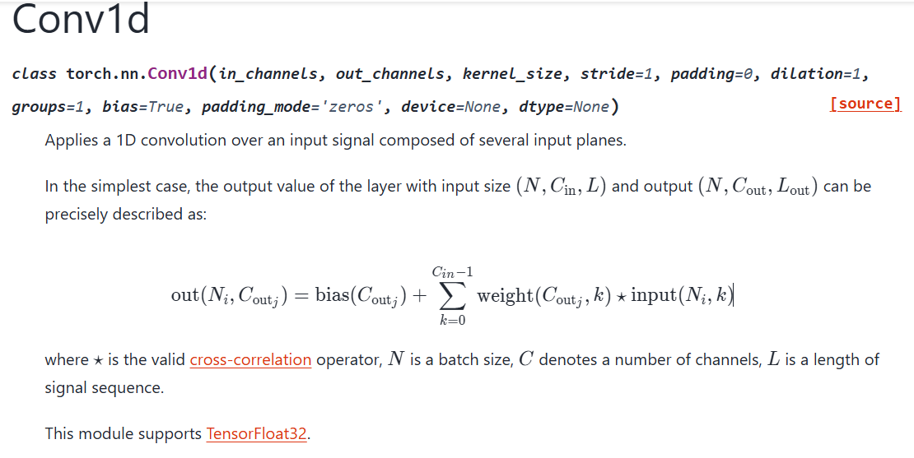

# 卷积模块的张量表示及梯度推导

## 一维卷积

**Pytorch的定义**

$$\operatorname{out}(N_i,C_{\operatorname{out}_j})=\operatorname{bias}(C_{\operatorname{out}_j})+\sum_{k=0}^{C_{in}-1}\operatorname{weight}(C_{\operatorname{out}_j},k)\star\operatorname{input}(N_i,k)$$

写成数学形式：

$$
y_{ni}=\sum_jv_{n(i+j)}w_{nj}
$$

偏置被放进求和号作为输入和卷积核的一部分。
将批次忽略，也就是只看某个样本卷积操作的公式就有：

$$
y_i=\sum_jv_{i+j}w_j
$$

**定义张量和索引：**

- $n$ : Batch (批次) 索引 (对应 $N_i$ )
- $j$ : 输出通道索引 (对应 $C_{out, j}$ )
- $k$ : 输入通道索引 (对应 $k$ )
- $i$ : 输出**空间**索引 (对应 $i_{\bar{y}}$ )
- $l$ : 输入**空间**索引 (对应 $l_{\bar{x}}$ )
- $p$ : 核 (kernel) **空间**索引 (对应 $j_{\bar{k}}$ )

**现在定义参与运算的张量：**

- **输出 $O$ :** $O_{nji}$ (Batch, Out-Channel, Out-Spatial)
- **输入 $I$ :** $I_{nkl}$ (Batch, In-Channel, In-Spatial)
- **权重 $W$ :** $W_{jkp}$ (Out-Channel, In-Channel, Kernel-Spatial)
- **偏差 $B$ :** $B_{j}$ (Out-Channel)
- **卷积张量 $C$ :** $C_{ilp}$ (Out-Spatial, In-Spatial, Kernel-Spatial)

---

**定义卷积张量 $C$ :**
这个 $C$ 张量定义了卷积操作本身

$$C_{ijl}=
\begin{cases}
1, & \mathrm{if} \quad l=i+j \\
0, & \mathrm{else} & 
\end{cases}$$

卷积操作的张量计算公式：

$$y_i=C_{ijl}v_lw_j$$

这里的 $v$ 表示输入数据，下标 $l$ 表示 $v$ 的第 $l$ 个分量。 $w_{j}$ 表示卷积核的第 $j$ 个分量。 $C_{ijl}$ 则表示卷积操作，将约束条件带入上式，就可得到

$$
y_i=v_{i+j}w_j
$$

扩

**加入步幅 $s$ 和膨胀 $d$ ：**
此时卷积操作加入了步幅长度 $s$ 和膨胀大小 $d$ ：

$$C_{ilp} = \begin{cases} 1, & \text{if } l = s \cdot i + d \cdot p \\ 0, & \text{else} \end{cases}$$

让我们通过一个简单的例子（ $d=1, s=2$ vs $s=1, d=2$ ）来理解。
**Stride (步幅) 的效果: $s=2, d=1$**

- **公式变为：** $l = 2 \cdot i + j$
- **它在做什么：** 缩放**输出索引 $i$** 。索引 $i$ 代表你正在计算**第几个**输出点。
- **我们来计算几个输出点：**
  - **计算 $y_0$ (即 $i=0$ ):**

关系是 $l = 2 \cdot 0 + j = j$ 。

$y_0 = \sum_j v_{j} \cdot w_j = v_0w_0 + v_1w_1 + v_2w_2 + \dots$

（核从输入的第 0 个位置开始）
  - **计算 $y_1$ (即 $i=1$ ):**

关系是 $l = 2 \cdot 1 + j = 2 + j$ 。

$y_1 = \sum_j v_{2+j} \cdot w_j = v_2w_0 + v_3w_1 + v_4w_2 + \dots$

（核从输入的第 2 个位置开始）
  - **计算 $y_2$ (即 $i=2$ ):**

关系是 $l = 2 \cdot 2 + j = 4 + j$ 。

$y_2 = \sum_j v_{4+j} \cdot w_j = v_4w_0 + v_5w_1 + v_6w_2 + \dots$

（核从输入的第 4 个位置开始）
- **结论 (Stride):**
  请注意：从计算 $y_0$ 变到 $y_1$ ，你的核在输入 $v$ 上滑动（或“跳跃”）了 2 个位置（从 0 到 2）。你跳过了本应在 $s=1$ 时计算的那个输出点。
  Stride 导致你计算的输出点 $y_i$ 的总数变少了。这就是缩放（下采样）效果的来源。

**Dilation (扩张) 的效果: $s=1, d=2$**

- **公式变为：** $l = i + 2 \cdot j$
- **它在做什么：** 缩放**核索引 $j$** 。索引 $j$ 代表核 $w$ 内部的**第几个**权重。
- **我们来计算几个输出点：**
  - **计算 $y_0$ (即 $i=0$ ):**

关系是 $l = 0 + 2 \cdot j = 2j$ 。

$y_0 = \sum_j v_{2j} \cdot w_j = v_0w_0 + v_2w_1 + v_4w_2 + \dots$
  - **计算 $y_1$ (即 $i=1$ ):**

关系是 $l = 1 + 2 \cdot j = 1 + 2j$ 。

$y_1 = \sum_j v_{1+2j} \cdot w_j = v_1w_0 + v_3w_1 + v_5w_2 + \dots$
  - **计算 $y_2$ (即 $i=2$ ):**

关系是 $l = 2 + 2 \cdot j = 2 + 2j$ 。

$y_2 = \sum_j v_{2+2j} \cdot w_j = v_2w_0 + v_4w_1 + v_6w_2 + \dots$
- **结论 (Dilation):**
  请注意：我们没有跳过任何输出点（我们计算了 $y_0, y_1, y_2, \dots$ ）。
  相反，为了计算单个输出点（比如 $y_0$ ），你的核 $w$ 的权重 ( $w_0, w_1, w_2$ ) 被应用到了间隔更开的输入点 ( $v_0, v_2, v_4$ ) 上。
  Dilation 并没有减少输出点的数量，而是增大了单个核的感受野 (receptive field)。核被‘撑大’了，中间有了‘空洞’。这就是扩张的含义。

## 一维卷积的梯度推导

前向公式：

$$
y_i=C_{ijl}v_lw_j
$$

卷积算子 $C_{ijl}$ 有定义,

$$C_{ijl}=
\begin{cases}
1, & \mathrm{if}\quad l=i+j \\
0, & \mathrm{else} & & 
\end{cases}$$

### 权重梯度

根据链式法则有,

$$\frac{\partial L}{\partial w_k}=\frac{\partial L}{\partial y_i}\frac{\partial y_i}{\partial w_k}$$

先计算雅可比项, 此处有

$$\begin{aligned}
\frac{\partial y_i}{\partial w_k}=C_{ijl}v_l\frac{\partial w_j}{\partial w_k}=C_{ijl}v_l\delta_{jk}=C_{ikl}v_l
\end{aligned}$$

代回链式法则，则有

$$
\frac{\partial L}{\partial w_k}
=\frac{\partial L}{\partial y_i}C_{ikl}v_l
=\frac{\partial L}{\partial y_i}v_{i+k}
$$

**结论：** 观察权重的梯度公式可以发现, 权重的梯度等于输入数据与误差信号做互相关。也就是哪个数据点与当前的误差信号最相似，就大幅更新这个权重。

### 数据梯度

我们对第 $m$ 个输入分量 $v_m$ 求偏导。这是为了将误差继续向前传播。
继续应用链式法则：

$$\frac{\partial L}{\partial v_m}=\frac{\partial L}{\partial y_i}\frac{\partial y_i}{\partial v_m}$$

先计算雅可比项, 此处有

$$\begin{aligned}
\frac{\partial y_i}{\partial v_m}=C_{ijl}w_j\frac{\partial v_l}{\partial v_m}=C_{ijl}w_j\delta_{lm}=C_{ijm}w_j
\end{aligned}$$

代回链式法则，则有

$$\frac{\partial L}{\partial v_m}=\frac{\partial L}{\partial y_i}C_{ijm}w_j$$

在这个求和式中， $i$ 是哑指标，需要确定 $i$ 的值，又因为 $m=i+j$ ，所以有 $i=m-j$ ，代回公式有

$$
\frac{\partial L}{\partial v_m}=\frac{\partial L}{\partial y_{m-j}}w_j
$$

**结论：** 输入的梯度等于 **输出梯度与翻转后的权重 $w$ 的卷积（Full Convolution）**。这在深度学习框架中通常被称为 **转置卷积（Transposed Convolution）** 或 **反卷积（Deconvolution）** 的数学基础。

## 二维卷积

为简化表示，我们做如下索引替换：

- 输出索引为 $(a, b)$
- 核索引为 $(c, d)$
- 输入索引为 $(e, f)$

1. **定义张量：**
   - 令输出张量为 $y$ ，其分量为 $y_{ab}$ 。
   - 令输入张量为 $v$ ，其分量为 $v_{ef}$ 。
   - 令核张量为 $w$ ，其分量为 $w_{cd}$ 。
   - 令 $(\star 2D)$ 卷积张量为 $C$ ，其分量为 $C_{abcdef}$ 。
2. **张量缩并（爱因斯坦求和形式）：**
   完整的 2D 卷积操作（类似于 1D 情况）可以写为：
   $\displaystyle y_{ab} = \sum_{c,d} \sum_{e,f} C_{abcdef} \cdot v_{ef} \cdot w_{cd}$
   使用爱因斯坦求和约定（省略 $\sum$ 符号），我们得到一个非常简洁的张量形式：
   $\displaystyle y_{ab} = C_{abcdef} v_{ef} w_{cd}$
   - $a, b$ 是**自由索引**，代表输出张量的维度。
   - $c, d, e, f$ 是**哑索引（缩并索引）**，因为它们在右侧重复出现，表示需要对它们的所有可能值求和。
3. **六阶卷积张量 $C$ 的定义：**
   这个六阶张量 $C_{abcdef}$ 的定义即是图像中 $(\star 2D)$ 的定义：
   $\displaystyle C_{abcdef} = \begin{cases} 1, & \text{if } (e, f) = (a, b) + (c, d) \\ 0, & \text{else} \end{cases}$
   这等价于两个独立的条件必须同时满足：
   - $e = a + c$
   - $f = b + d$

**验证**
这种形式再次等价于标准的 2D 卷积。如果我们从 $y_{ab} = \sum_{c,d} \sum_{e,f} C_{abcdef} v_{ef} w_{cd}$ 开始：

1. 对 $e, f$ 求和：由于 $C_{abcdef}$ 仅在 $e=a+c$ 和 $f=b+d$ 时为 1， $\sum_{e,f} C_{abcdef} v_{ef}$ 这一项塌缩为 $v_{a+c, b+d}$ 。
2. 代回结果： $y_{ab} = \sum_{c,d} v_{a+c, b+d} \cdot w_{cd}$ 。
3. 这正是 2D 卷积的标准定义（将 $(a,b)$ 视为输出坐标， $(c,d)$ 视为核坐标）。

**加入步幅和膨胀**

- **步幅 (Stride):** $s = (s_0, s_1)$
- **扩张 (Dilation):** $d = (d_0, d_1)$

1. **张量缩并 (爱因斯坦求和形式):**
   整个 2D 卷积操作（包含通道）可以写为：
   $\displaystyle y_{ab} = C_{abcdef} v_{ef} w_{cd}$
   - $a, b$ 是**自由索引**，定义了我们正在计算的输出张量的分量。
   - $c, d, e, f$ 是**哑索引**，表示我们需要对这些索引的所有可能值求和。
2. **六阶卷积张量 $C$ 的定义:**
   这个六阶张量 $C$ 包含了所有关于步幅和扩张的**结构信息**。其分量 $C_{abcdef}$ 定义如下：
   $\displaystyle C_{abcdef} = \begin{cases} 1, & \text{if } (e = s_0 \cdot a + d_0 \cdot c) \quad \textbf{and} \quad (f = s_1 \cdot b + d_1 \cdot d) \\ 0, & \text{else} \end{cases}$
   这个定义非常清晰地展示了 $s$ 和 $d$ 是如何分别作用于不同维度的：

- $s_0, d_0$ 掌控着第 0 维 (索引 $a, c, e$ ) 的映射关系。
- $s_1, d_1$ 掌控着第 1 维 (索引 $b, d, f$ ) 的映射关系。
